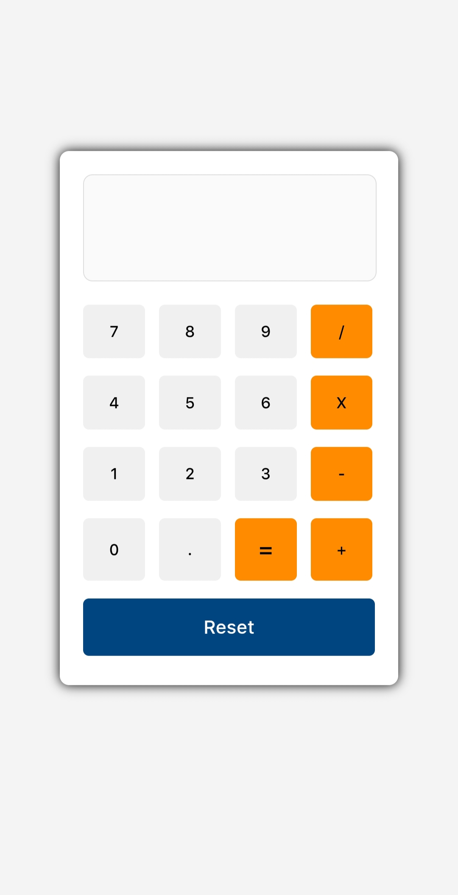

# My First Calculator 🧮

A simple web-based calculator built as a practice project using HTML, CSS, and JavaScript. This app supports basic arithmetic operations such as addition, subtraction, multiplication, and division.

---

## 📂 Project Structure
 ├── index.html      # Main HTML structure 
 ├── style.css       # UI styling 
 └── script.js       # Calculator logic

---

## ✨ Features

- Clean and responsive layout
- Supports basic operations: +, -, ×, ÷
- Real-time result display
- `Reset` button to clear input
- Modern design with bold contrast colors (orange & blue)

---

## 🧠 Technologies Used

- **HTML** for page structure
- **CSS** for layout and styling
- **JavaScript** for handling input and calculation logic

---

## 📱 Preview

| Mobile View |
|------------------------|
|  |
---

## 🚀 How to Run

1. Clone or download this repository
2. Open the `index.html` file in any browser
3. Start using the calculator!

---

## 📌 Notes

This is a beginner-friendly project, ideal for learning:
- DOM manipulation
- Event handling
- Basic UI design

---

## 📫 Contact

For questions or collaborations, feel free to reach out!

---
🔗 [View Live Calculator](https://taufiqlhm2u.github.io/my-first-calculator/)